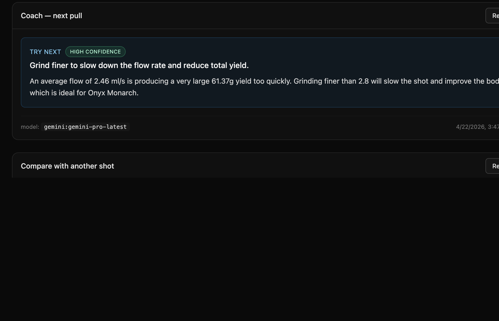

<div align="center">

# ☕ Caffeine

**A self-hosted companion app for the [Meticulous](https://meticuloushome.com) espresso machine.**

Live shot charts · AI analysis · coach suggestions · shot-to-shot compare · scheduled preheats · Web Push · installable PWA.
Single container, SQLite-backed, everything stays on your LAN.

[](https://github.com/apohor/caffeine/actions/workflows/build.yml)
[](https://github.com/apohor/caffeine/pkgs/container/caffeine)
[](LICENSE)


</div>

---

## What it does

Caffeine runs next to your machine on any always-on box (NAS, Raspberry
Pi, old Mac mini) and gives you a polished web UI, an AI shot critic,
scheduled preheats, and real-time notifications on your phone — all
from a single Docker container.

**No cloud. No account. No outbound dependency** beyond the AI
provider you opt into.

## Features

<table>
<tr>
<td width="50%" valign="top">

### Shots
- **Live view** — pressure / flow / weight / temperature charted in
  real time via a WebSocket bridge to the machine.
- **Instant capture** — the moment the paddle drops, the shot is
  saved; no waiting for the machine's own history sync.
- **Searchable history** with uPlot charts, profile metadata, notes,
  star rating, and voice notes.

</td>
<td>


</td>
</tr>

<tr>
<td colspan="2">

### AI shot analysis — OpenAI · Anthropic · Gemini

Three providers, one UI. Pick the model from a dropdown populated
live from the provider's own catalogue. Every new shot gets auto-
analysed in the background, ready when you walk up to the machine.
Results persist per `(shot, model)` so re-opening a shot never
re-bills the LLM.


</td>
</tr>

<tr>
<td colspan="2">

### Coach + Compare

**Coach** gives you one focused, high-confidence change to try on
your next pull, informed by recent shots on the same profile.
**Compare** explains the metric diffs between any two shots — useful
for dialing in a new bean or validating a grinder change. Both are
cached on disk and re-used on every subsequent open.



</td>
</tr>

<tr>
<td width="50%" valign="top">

### Profiles
- Browse every profile on the machine with images and stage detail.
- Edit stage numerics (temperature, final weight, timings) and save
  back to the machine over its own API.
- Apply AI recipe suggestions with one click.

</td>
<td>


</td>
</tr>

<tr>
<td width="50%" valign="top">

### Everything else
- **Preheat schedules** — cron-style, with a one-tap manual preheat
  on the home page. "Warm up on weekdays at 07:15" and the machine
  is ready when you walk in.
- **Installable PWA** on iPhone / iPad / Android / desktop Chrome
  with offline app-shell and notch-aware safe-area insets.
- **Web Push notifications** for *shot finished* and *analysis ready*,
  delivered by the OS even when the app isn't open. Works on iOS
  16.4+ once installed to the home screen. Zero-config VAPID — the
  keypair is generated on first run.
- **Transparent machine proxy** at `/api/machine/*` so you can script
  against a single origin (and over HTTPS behind a reverse proxy).

</td>
<td>


</td>
</tr>
</table>

## Operator-friendly

- **Single container.** Go binary + embedded web bundle; no separate
  frontend service, no Node at runtime, no nginx.
- **Multi-arch image** — `linux/amd64` + `linux/arm64` on GHCR. Runs
  natively on a Synology, a Raspberry Pi 4/5, or an M-series Mac.
- **Distroless base** — tiny image, no shell, no package manager.
- **Embedded zoneinfo** — `TZ=America/New_York` works out of the box.
- **Structured JSON logs** via `log/slog` — plugs into any log stack.

## Quick start

```bash
docker run -d --name caffeine -p 8080:8080 \
  -v caffeine-data:/data \
  -e MACHINE_URL=http://<your-machine-ip> \
  -e TZ=America/New_York \
  ghcr.io/apohor/caffeine:latest
```

Open <http://localhost:8080> and head to **Settings** to pick an AI
provider, enable notifications, and set a preheat schedule.

**Full installation guide:** [docs/INSTALL.md](docs/INSTALL.md) —
covers Docker Compose, Synology, configuration reference, AI
providers, HTTPS / reverse proxy, backup, upgrade, uninstall.

## Development

```bash
make dev-mock                                  # fake Meticulous on :8090
MACHINE_URL=http://localhost:8090 make dev-api # Go API on :8080
make dev-web                                   # Vite on :5173
```

Open <http://localhost:5173>. You don't need a real machine —
`cmd/mockmachine` speaks enough of the Meticulous API (including
socket.io) to exercise every Caffeine code path.

**Full development guide:** [docs/DEVELOPMENT.md](docs/DEVELOPMENT.md)
— architecture, repo layout, make targets, testing, releasing.

## Stack

- **Backend:** Go 1.25, `chi`, `log/slog`, pure-Go SQLite
  (`modernc.org/sqlite`), `coder/websocket`, `webpush-go`.
- **AI:** OpenAI Chat Completions, Anthropic Messages, Google
  Generative Language — hot-swappable from the UI.
- **Frontend:** React 18 + TypeScript + Vite 5 + Tailwind v3, TanStack
  Query, React Router, uPlot, react-markdown.
- **Browser targets:** Safari 15+ / iOS 15+ / evergreen Chromium &
  Firefox.
- **CI/CD:** one GitHub Actions workflow — vet, test, typecheck,
  build, publish multi-arch image to GHCR on every `vX.Y.Z` tag.

## Status

Actively developed. Tagged releases are usable day-to-day on a home
LAN. Self-hosted only — no cloud accounts, no telemetry. There is no
built-in auth yet; if you expose Caffeine publicly, put it behind a
reverse-proxy auth layer (see
[INSTALL.md](docs/INSTALL.md#exposing-caffeine-beyond-your-lan)).

## Contributing

Issues and PRs welcome. See [CONTRIBUTING.md](CONTRIBUTING.md) for the
short version.

## Trademarks

*Meticulous* is a trademark of Meticulous Home Inc. Caffeine is an
independent, unaffiliated third-party project and is not endorsed by
or associated with Meticulous Home Inc.

## Licence

[MIT](LICENSE)
# Caffeine

A self-hosted companion app for the
[Meticulous](https://meticuloushome.com) espresso machine.

Caffeine runs next to your machine on any always-on box (NAS, Raspberry
Pi, old Mac mini) and gives you a polished web UI, an AI shot critic,
scheduled preheats, and real-time notifications on your phone — all
from a single Docker container.

> **Status:** actively developed · tagged releases are usable in
> production on a home LAN · self-hosted only, no cloud accounts.

---

## Features

### Shots
- **Live shot view.** Pressure / flow / weight / temperature charted in
  real time as you pull, via a WebSocket bridge to the machine.
- **Instant capture.** The moment the paddle drops, the shot is saved
  locally — you don't have to wait minutes for the machine's own
  history sync.
- **Rich history.** Searchable list of every shot with uPlot charts,
  profile metadata, and side-by-side view with any cached AI critique.
- **SQLite-backed cache.** Never lose a shot because the machine was
  rebooting or the network blipped; Caffeine reconciles on schedule.

### AI shot analysis
- **Three providers, one UI:** OpenAI, Anthropic, and Google Gemini.
  Pick the model from a dropdown populated live from the provider's
  own catalogue — no guessing model IDs.
- **Auto-analyse.** Every new shot gets a critique in the background;
  it's waiting for you when you walk up to the machine.
- **Hot-swappable.** Provider / model / API key can all be changed
  from the Settings page; the analyser rebuilds in place, no restart.
- **Keys never leave the server.** The browser only sees
  `{ has_key: true }`; secrets live in SQLite on your volume.

### Profiles
- **Browse & inspect** every profile on the machine, with images and
  stage detail.
- **Stage editor** for the numeric knobs (temperature, final weight,
  timings) — saved back to the machine over its own API.

### Preheat schedules
- **Cron-style preheat.** "Warm up on weekdays at 07:15" so the
  machine is pull-ready when you walk in.
- **One-tap manual preheat** from the Home page.
- **Next-scheduled indicator** on the Settings page.

### Progressive Web App (installable)
- **Add to Home Screen** on iPhone / iPad / Android / desktop Chrome —
  launches full-screen with a real icon and no Safari chrome.
- **Offline app-shell.** The service worker ships a cached shell so the
  home-screen icon opens something useful even if your Caffeine box is
  asleep or you're off-LAN. `/api/*` always hits the network — shot
  data is never stale.
- **Notch-aware.** Safe-area insets so the sticky header clears the
  iPad notch and Dynamic Island.

### Web Push notifications
- **"Shot finished"** and **"AI analysis ready"** pushes delivered by
  the OS — the PWA doesn't need to be open.
- **Tap to jump.** Tapping a notification focuses the installed PWA
  (or opens a new tab) straight on that shot's history page.
- **Per-device toggles.** Each browser / phone subscribes independently
  and can opt specific notification kinds in or out.
- **Zero-config VAPID.** Caffeine generates a keypair on first run
  and persists it in SQLite; no `openssl` dance, no env plumbing.
- **Works on iOS 16.4+** when installed to the home screen (Apple's
  rule, not ours). In regular Safari the toggle shows *"not supported
  on this device"*.

### Transparent machine proxy
- `/api/machine/*` tunnels straight to the Meticulous machine's own
  REST API, so you can script against a single origin (and over
  HTTPS, if you put Caffeine behind a reverse proxy).
- Machine status is probed continuously; the header shows a live
  connected / degraded / offline badge.

### Operator-friendly
- **Single container.** Go binary + embedded web bundle; no separate
  frontend service, no Node at runtime, no nginx.
- **Multi-arch image.** `linux/amd64` + `linux/arm64` on GHCR — runs
  natively on a Synology, a Raspberry Pi 4/5, or an M-series Mac.
- **Distroless base.** Tiny image, no shell, no package manager — just
  the binary.
- **Timezone-aware.** `TZ=America/New_York` works out of the box; the
  full IANA zoneinfo database is embedded in the binary.
- **Structured JSON logs** via `log/slog`; works with any log stack.

---

## Quick start

### Run against your machine

Pull the latest image and point it at your Meticulous:

```bash
docker run -d --name caffeine -p 8080:8080 \
  -v caffeine-data:/data \
  -e MACHINE_URL=http://<your-machine-ip> \
  -e TZ=America/New_York \
  ghcr.io/apohor/caffeine:latest
```

Open <http://localhost:8080>. Then:

1. Visit **Settings → AI shot analysis**, pick a provider, paste an API
   key. Your next shot gets a free auto-critique.
2. Visit **Settings → Notifications**, flip the toggle to get pushes on
   shot finish / analysis ready. On iOS install to the home screen
   first (Share → *Add to Home Screen*), then enable.
3. Optionally set a **Preheat schedule** so the machine is ready at
   your usual coffee time.

### Via `docker compose`

```yaml
services:
  caffeine:
    image: ghcr.io/apohor/caffeine:latest
    ports: ["8080:8080"]
    environment:
      MACHINE_URL: http://meticulous.local
      TZ: America/New_York
    volumes:
      - caffeine-data:/data
    restart: unless-stopped
volumes:
  caffeine-data:
```

### Exposing Caffeine beyond your LAN

For notifications and PWA install to work end-to-end on iOS, Caffeine
must be reachable over **HTTPS**. The easiest setups:

- **Synology reverse proxy** with Let's Encrypt.
- **Tailscale Funnel** or **Cloudflare Tunnel** — HTTPS without
  opening ports.
- **Caddy / nginx** in front of the container on a VPS.

No auth is built in yet; if you expose Caffeine publicly, put it
behind a reverse-proxy auth layer (Authelia, Cloudflare Access,
basic auth, …) for now.

### Available image tags

| Tag | Source |
|---|---|
| `latest` | Most recent release tag |
| `vX.Y.Z` / `X.Y` | Git tag `vX.Y.Z` |
| `main` | Latest `main` branch |
| `main-<sha>` | Pinned to a specific commit |

---

## Configuration

Everything that isn't an AI key is set via environment variables; AI
keys are managed from the Settings page and stored in the `/data`
volume alongside the SQLite database.

| Variable | Default | Purpose |
|---|---|---|
| `MACHINE_URL` | `http://meticulous.local` | Base URL of the Meticulous machine. |
| `ADDR` | `:8080` | HTTP listen address. |
| `DATA_DIR` | `./data` (container: `/data`) | Where SQLite lives. Mount a volume here. |
| `SYNC_INTERVAL` | `15m` | How often to reconcile with the machine's `/history`. Live capture is instant; this is a safety net. |
| `TZ` | *system* | IANA zone (embedded; no need for `/usr/share/zoneinfo`). Used by preheat schedules. |
| `VAPID_PUBLIC_KEY`, `VAPID_PRIVATE_KEY` | *auto* | Override the auto-generated Web Push keypair. Leave unset to let Caffeine manage it. |
| `VAPID_SUBJECT` | `mailto:caffeine@localhost` | The `Subscriber` claim push services see. |
| `OPENAI_API_KEY`, `ANTHROPIC_API_KEY`, `GEMINI_API_KEY` | — | *Seed* values for a fresh database only. Prefer the Settings UI. |

---

## Development

### Native (fastest HMR)

Two terminals:

```bash
# Go API on :8080
make dev-api

# Vite dev server on :5173 (proxies /api → :8080)
make dev-web
```

Open <http://localhost:5173>.

### Developing without a real machine

`cmd/mockmachine` is a small stand-in that speaks enough of the
Meticulous API (history, preheat, reachability probe, and an
Engine.IO v4 + socket.io v4 WebSocket that emits fake `status`
events) to exercise every caffeine code path except flashing real
firmware. Run three terminals:

```bash
make dev-mock                                       # fake machine on :8090
MACHINE_URL=http://localhost:8090 make dev-api
make dev-web
```

To keep the default `http://meticulous.local` URL working (so the
mDNS path in the status probe is exercised too), add a hosts entry
and run the mock on port 80:

```bash
sudo sh -c 'echo "127.0.0.1 meticulous.local" >> /etc/hosts'
sudo go run ./cmd/mockmachine -addr :80 -simulate 60s
```

Trigger a one-shot fake extraction on demand (bypasses the
simulator interval):

```bash
curl http://localhost:8090/debug/fire-shot
```

### Dockerized dev stack

```bash
make docker-dev
# UI:     http://localhost:5173
# API:    http://localhost:8080
```

### Production-like local build

```bash
make build          # Go binary with embedded web bundle at ./bin/caffeine
docker compose up --build
```

### Useful make targets

```text
make dev          # both services via docker-compose.dev.yml
make dev-api      # Go server only
make dev-web      # Vite only
make dev-mock     # fake Meticulous machine on :8090 (for hardware-free dev)
make web          # build the web bundle into internal/web/dist
make build        # Go binary with embedded bundle
make test         # go test ./...
make fmt          # go fmt ./...
make tidy         # go mod tidy
make docker       # build the production image
```

---

## Stack

- **Backend:** Go 1.25, `chi` router, `log/slog`, `coder/websocket`
  live bridge, pure-Go SQLite (`modernc.org/sqlite`),
  `webpush-go` for VAPID-signed push.
- **AI:** OpenAI Chat Completions, Anthropic Messages, Google
  Generative Language — provider + model + key configured from the
  UI, hot-swappable, retried with exponential back-off on transient
  provider errors.
- **PWA:** hand-rolled offline app-shell service worker, maskable icons
  generated from the app's SVG via `@resvg/resvg-js`, `env(safe-area-
  inset-*)` padding for notched devices.
- **Frontend:** React 18 + TypeScript + Vite 5 + Tailwind v3, TanStack
  Query, React Router, uPlot for shot charts, react-markdown for AI
  output.
- **Browser targets:** Safari 15+ / iOS 15+ / evergreen Chromium &
  Firefox. Vite `@vitejs/plugin-legacy` down-compiles modern syntax;
  Tailwind v3 avoids v4's Safari-16.4 requirements.
- **CI/CD:** single GitHub Actions workflow runs `go vet`, `go test`,
  web typecheck + build, then publishes a multi-arch (amd64 + arm64)
  image to GHCR on every `vX.Y.Z` tag.

---

## Layout

```
cmd/caffeine/          single entrypoint
internal/
  ai/                  OpenAI / Anthropic / Gemini analyzer
  api/                 chi HTTP handlers + SPA serve
  config/              runtime config struct
  live/                live shot WebSocket hub + recorder
  machine/             reverse proxy to the Meticulous machine
  preheat/             cron-style preheat scheduler
  push/                Web Push subscriptions + VAPID + fan-out
  settings/            AI settings store + hot-swap manager
  shots/               SQLite shot cache + periodic syncer
  web/                 //go:embed of the built Vite bundle
web/                   Vite + React + Tailwind app
Dockerfile             multi-stage build (web → go → distroless)
docker-compose.yml     production-like single container (SQLite on /data)
docker-compose.dev.yml dev stack with HMR
```

---

## Licence

TBD.
# Caffeine

Espresso companion for the [Meticulous](https://meticuloushome.com) machine.
Single Go binary, React UI, AI shot analysis, old browsers friendly.

## Stack

- **Backend:** Go 1.25, `chi` router, `log/slog`, embedded web assets, transparent reverse proxy to the Meticulous machine, pure-Go SQLite (`modernc.org/sqlite`) for shot cache + settings, `coder/websocket` for the live shot bridge, `webpush-go` for Web Push fan-out.
- **AI:** OpenAI Chat Completions, Anthropic Messages, Google Generative Language — provider + model + API key configured from the UI, stored in SQLite, hot-swappable without a restart.
- **PWA:** installable on iOS/iPadOS and desktop; offline app-shell service worker; Web Push notifications on shot finish and analysis ready (VAPID keypair auto-generated on first run, persisted in SQLite).
- **Frontend:** React 18 + TypeScript + Vite 5 + Tailwind v3 (+ `postcss-preset-env`), TanStack Query, React Router, uPlot for shot charts, react-markdown for AI output.
- **Browser targets:** Safari 15+ / iOS 15+ / evergreen Chromium & Firefox. Vite `@vitejs/plugin-legacy` down-compiles modern syntax; Tailwind v3 avoids v4's Safari-16.4 requirements.
- **CI/CD:** Single GitHub Actions workflow (`build`) runs go vet + go test + web typecheck/build, then publishes a multi-arch (amd64 + arm64) image to GHCR.

## Quick start

### Native dev (recommended — fastest HMR)

Two terminals:

```bash
# 1. Go API on :8080
make dev-api

# 2. Vite on :5173 (proxies /api to :8080)
make dev-web
```

Open <http://localhost:5173>.

### Dockerized dev stack (Go + Vite via compose)

```bash
make docker-dev
# UI:        http://localhost:5173
# Health:    http://localhost:8080/api/health
```

### Production-like docker build

```bash
docker compose up --build
open http://localhost:8080
```

### Pre-built image from GHCR

Every push to `main` and every `vX.Y.Z` tag publishes a multi-arch
(amd64 + arm64) image to
[ghcr.io/apohor/caffeine](https://github.com/apohor/caffeine/pkgs/container/caffeine).

| Tag | Source |
|---|---|
| `latest` | Most recent release tag |
| `vX.Y.Z`, `X.Y` | Git tag `vX.Y.Z` |
| `main` | Latest `main` branch |
| `main-<sha>` | Pinned to a specific commit |

```bash
docker run --rm -p 8080:8080 \
  -v caffeine-data:/data \
  -e MACHINE_URL=http://<your-machine-ip> \
  ghcr.io/apohor/caffeine:latest
```

AI keys are configured from the Settings page and persisted in the
`/data` volume — no env plumbing required on the host.

## Layout

```
cmd/caffeine/            main entrypoint
internal/
  api/                 chi handlers
  config/              runtime config
  machine/             reverse proxy to the Meticulous machine
  shots/               SQLite shot cache + periodic syncer
  web/                 //go:embed of built Vite bundle
web/                   Vite + React app (uPlot for shot charts)
Dockerfile             multi-stage build (web → go → distroless)
docker-compose.yml     prod-ish single container (SQLite cache on /data volume)
docker-compose.dev.yml dev stack with HMR
```
