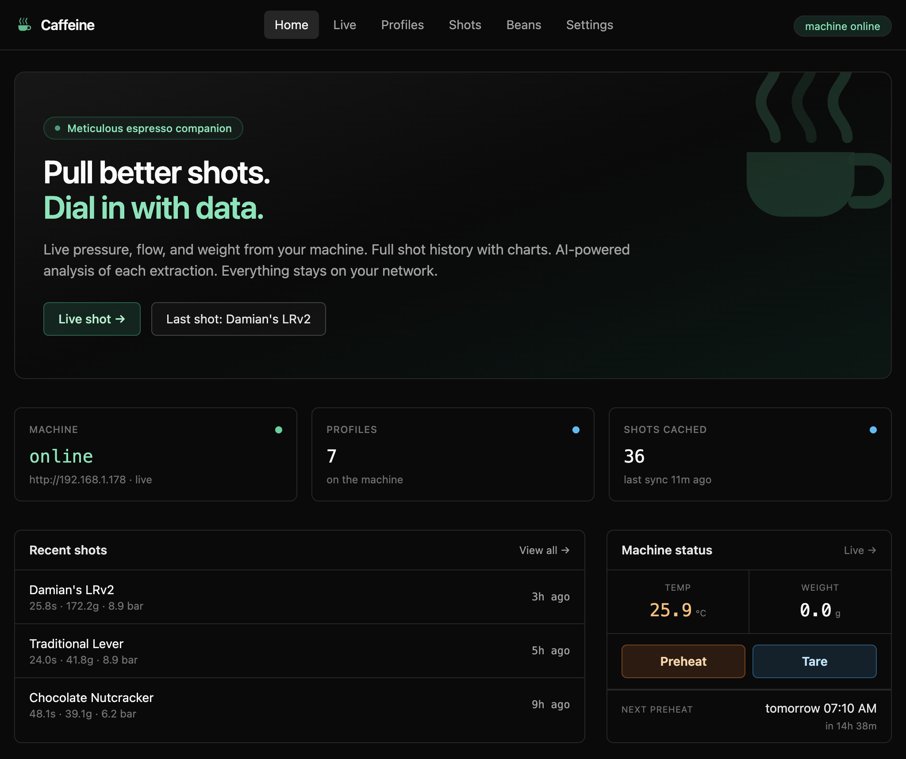
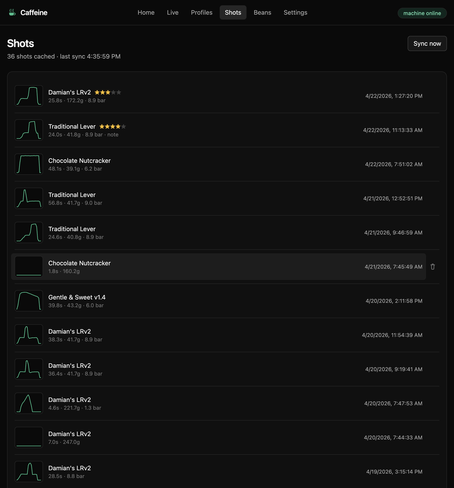
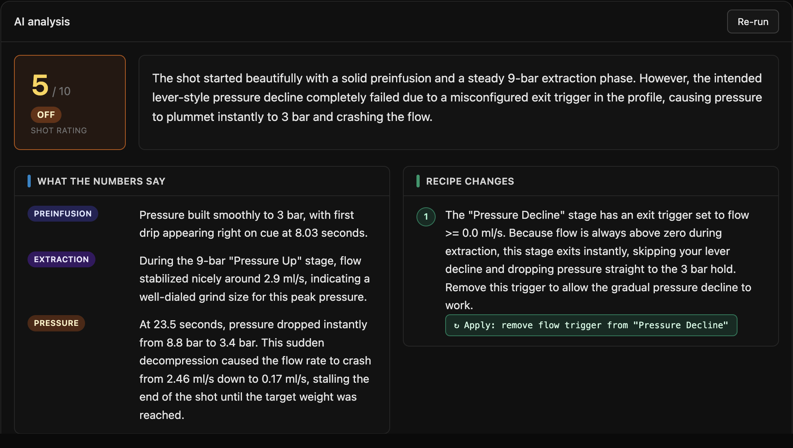
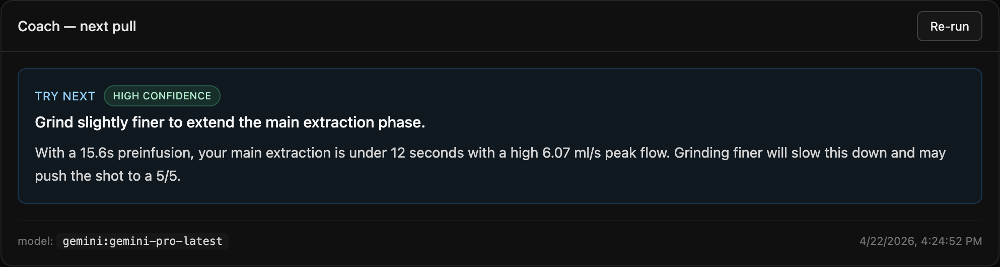
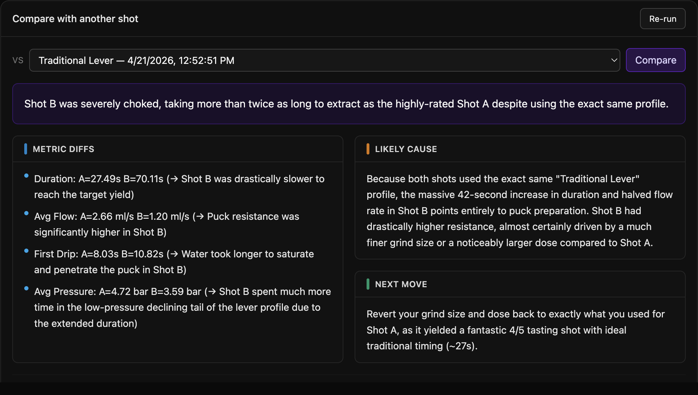
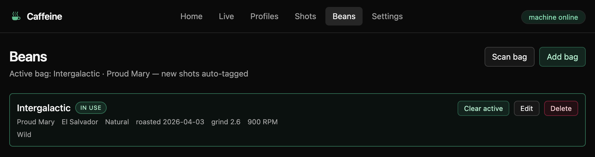
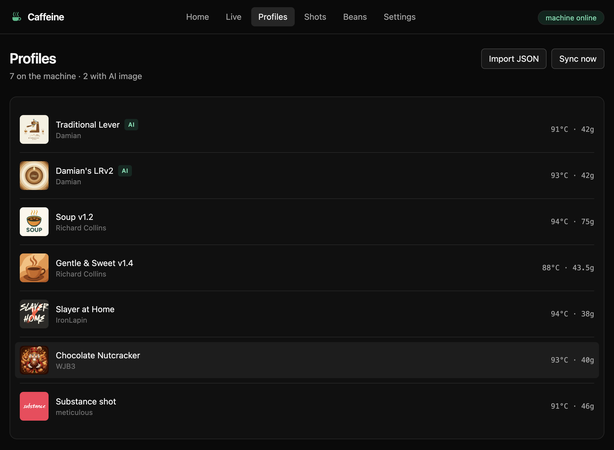
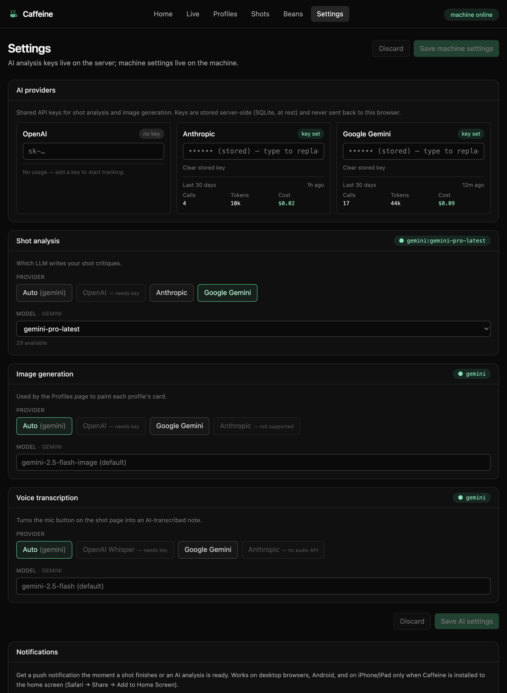

<div align="center">


# Caffeine

**A self-hosted companion app for the [Meticulous](https://meticuloushome.com) espresso machine.**

Live shot charts · AI analysis · coach suggestions · shot-to-shot compare · scheduled preheats · Web Push · installable PWA.
Single container, SQLite-backed, everything stays on your LAN.

[](https://github.com/apohor/caffeine/actions/workflows/build.yml)
[](https://github.com/apohor/caffeine/pkgs/container/caffeine)
[](LICENSE)



</div>

---

## What it does

Caffeine runs next to your machine on any always-on box (NAS, Raspberry
Pi, old Mac mini) and gives you a polished web UI, an AI shot critic,
scheduled preheats, and real-time notifications on your phone — all
from a single Docker container.

**No cloud. No account. No outbound dependency** beyond the AI
provider you opt into.

## Features

<table>
<tr>
<td width="50%" valign="top">

### Shots
- **Live view** — pressure / flow / weight / temperature charted in
  real time via a WebSocket bridge to the machine.
- **Instant capture** — the moment the paddle drops, the shot is
  saved; no waiting for the machine's own history sync.
- **Searchable history** with uPlot charts, profile metadata, notes,
  star rating, and voice notes.

</td>
<td>



</td>
</tr>

<tr>
<td colspan="2">

### AI shot analysis — OpenAI · Anthropic · Gemini

Three providers, one UI. Pick the model from a dropdown populated
live from the provider's own catalogue. Every new shot gets auto-
analysed in the background, ready when you walk up to the machine.
Results persist per `(shot, model)` so re-opening a shot never
re-bills the LLM.



</td>
</tr>

<tr>
<td colspan="2">

### Coach + Compare

**Coach** gives you one focused, high-confidence change to try on
your next pull, informed by recent shots on the same profile.
**Compare** explains the metric diffs between any two shots — useful
for dialing in a new bean or validating a grinder change. Both are
cached on disk and re-used on every subsequent open.





</td>
</tr>

<tr>
<td width="50%" valign="top">

### Beans
- Keep a running inventory of bean bags — roaster, origin, process,
  roast date, tasting notes.
- Mark one bag **active** and every new shot is auto-tagged with it,
  along with your default grind setting and grinder RPM for that bag.
- Shots remember the bag they came from, so the AI analysis and
  coach can factor bean choice into their suggestions.
- Scan a QR code on the bag (or paste a URL) to pre-fill a new bag
  from a roaster's website.

</td>
<td>



</td>
</tr>

<tr>
<td width="50%" valign="top">

### Profiles
- Browse every profile on the machine with images and stage detail.
- Edit stage numerics (temperature, final weight, timings) and save
  back to the machine over its own API.
- Apply AI recipe suggestions with one click.

</td>
<td>



</td>
</tr>

<tr>
<td width="50%" valign="top">

### Everything else
- **Preheat schedules** — cron-style, with a one-tap manual preheat
  on the home page. "Warm up on weekdays at 07:15" and the machine
  is ready when you walk in.
- **Installable PWA** on iPhone / iPad / Android / desktop Chrome
  with offline app-shell and notch-aware safe-area insets.
- **Web Push notifications** for *shot finished* and *analysis ready*,
  delivered by the OS even when the app isn't open. Works on iOS
  16.4+ once installed to the home screen. Zero-config VAPID — the
  keypair is generated on first run.
- **Transparent machine proxy** at `/api/machine/*` so you can script
  against a single origin (and over HTTPS behind a reverse proxy).

</td>
<td>



</td>
</tr>
</table>

## Operator-friendly

- **Single container.** Go binary + embedded web bundle; no separate
  frontend service, no Node at runtime, no nginx.
- **Multi-arch image** — `linux/amd64` + `linux/arm64` on GHCR. Runs
  natively on a Synology, a Raspberry Pi 4/5, or an M-series Mac.
- **Distroless base** — tiny image, no shell, no package manager.
- **Embedded zoneinfo** — `TZ=America/New_York` works out of the box.
- **Structured JSON logs** via `log/slog` — plugs into any log stack.

## Quick start

```bash
docker run -d --name caffeine -p 8080:8080 \
  -v caffeine-data:/data \
  -e MACHINE_URL=http://<your-machine-ip> \
  -e TZ=America/New_York \
  ghcr.io/apohor/caffeine:latest
```

Open <http://localhost:8080> and head to **Settings** to pick an AI
provider, enable notifications, and set a preheat schedule.

**Full installation guide:** [docs/INSTALL.md](docs/INSTALL.md) —
covers Docker Compose, Synology, configuration reference, AI
providers, HTTPS / reverse proxy, backup, upgrade, uninstall.

## Development

```bash
make dev-mock                                  # fake Meticulous on :8090
MACHINE_URL=http://localhost:8090 make dev-api # Go API on :8080
make dev-web                                   # Vite on :5173
```

Open <http://localhost:5173>. You don't need a real machine —
`cmd/mockmachine` speaks enough of the Meticulous API (including
socket.io) to exercise every Caffeine code path.

**Full development guide:** [docs/DEVELOPMENT.md](docs/DEVELOPMENT.md)
— architecture, repo layout, make targets, testing, releasing.

## Stack

- **Backend:** Go 1.25, `chi`, `log/slog`, pure-Go SQLite
  (`modernc.org/sqlite`), `coder/websocket`, `webpush-go`.
- **AI:** OpenAI Chat Completions, Anthropic Messages, Google
  Generative Language — hot-swappable from the UI.
- **Frontend:** React 18 + TypeScript + Vite 5 + Tailwind v3, TanStack
  Query, React Router, uPlot, react-markdown.
- **Browser targets:** Safari 15+ / iOS 15+ / evergreen Chromium &
  Firefox.
- **CI/CD:** one GitHub Actions workflow — vet, test, typecheck,
  build, publish multi-arch image to GHCR on every `vX.Y.Z` tag.

## Status

Actively developed. Tagged releases are usable day-to-day on a home
LAN. Self-hosted only — no cloud accounts, no telemetry. There is no
built-in auth yet; if you expose Caffeine publicly, put it behind a
reverse-proxy auth layer (see
[INSTALL.md](docs/INSTALL.md#exposing-caffeine-beyond-your-lan)).

## Contributing

Issues and PRs welcome. See [CONTRIBUTING.md](CONTRIBUTING.md) for the
short version.

## Trademarks

*Meticulous* is a trademark of Meticulous Home Inc. Caffeine is an
independent, unaffiliated third-party project and is not endorsed by
or associated with Meticulous Home Inc.

## Licence

[MIT](LICENSE)

