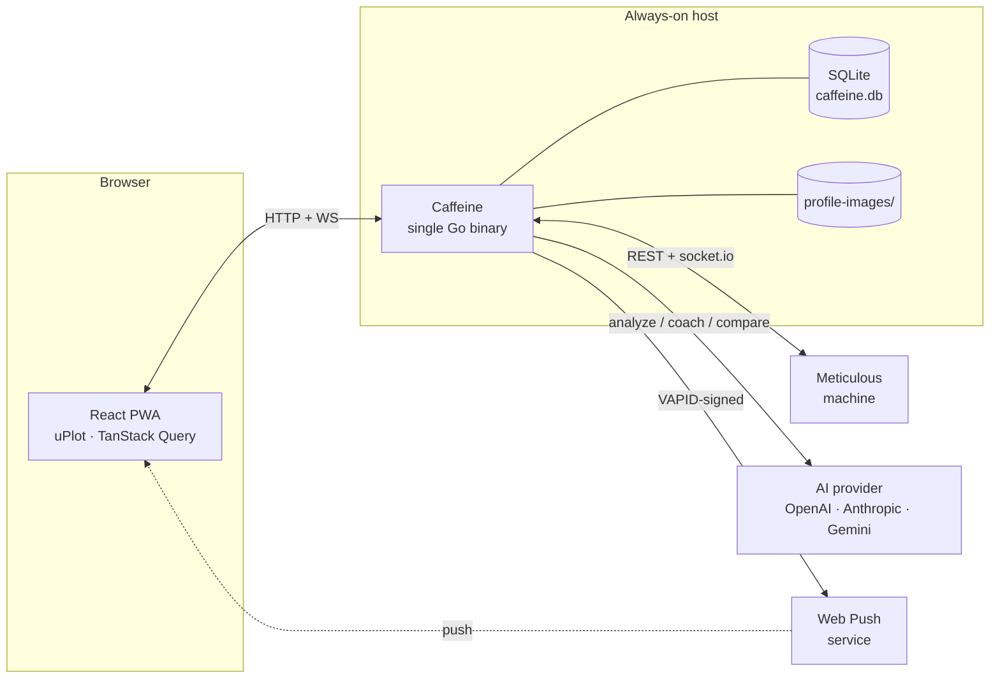

# Development

This is what you need to hack on Caffeine. For running a release,
see [INSTALL.md](INSTALL.md).

- [Prerequisites](#prerequisites)
- [Quick start](#quick-start)
- [Developing without a machine](#developing-without-a-machine)
- [Repo layout](#repo-layout)
- [Architecture](#architecture)
- [Make targets](#make-targets)
- [Testing](#testing)
- [Releasing](#releasing)
- [Contributing](#contributing)

## Prerequisites

- **Go 1.25+**
- **Node.js 20+** and **npm**
- **Docker** (optional — only for `make docker-dev` or building the
  production image locally)

macOS:

```bash
brew install go node
```

Clone:

```bash
git clone https://github.com/apohor/caffeine.git
cd caffeine
```

## Quick start

Three terminals give you the best experience — fastest HMR, clearest
logs:

```bash
# 1. Fake Meticulous machine on :8090
make dev-mock

# 2. Go API on :8080, pointing at the mock
MACHINE_URL=http://localhost:8090 make dev-api

# 3. Vite dev server on :5173 (proxies /api → :8080)
make dev-web
```

Open <http://localhost:5173>. Hot-reload works for both Go
(via the `go run` restart loop) and React (via Vite HMR).

If you already have a real Meticulous on your LAN you can skip
`dev-mock` and point `MACHINE_URL` at the machine instead.

## Developing without a machine

`cmd/mockmachine` is a small stand-in that speaks enough of the
Meticulous API to exercise every Caffeine code path — history,
profiles, preheat, reachability probe, and an Engine.IO v4 +
socket.io v4 WebSocket that emits fake `status` events. It even
simulates a full shot end-to-end so the live view, shot recorder,
and AI auto-analysis all fire.

```bash
# Run the mock with a periodic simulated extraction every 60s:
make dev-mock

# Or with custom cadence and a specific starting shot count:
go run ./cmd/mockmachine -addr :8090 -simulate 60s -shots 8

# Trigger a one-shot fake extraction on demand:
curl http://localhost:8090/debug/fire-shot
```

To exercise the mDNS code path too (the default `http://meticulous.local`),
add a hosts entry and run the mock on port 80:

```bash
sudo sh -c 'echo "127.0.0.1 meticulous.local" >> /etc/hosts'
sudo go run ./cmd/mockmachine -addr :80 -simulate 60s
```

## Repo layout

```
cmd/
  caffeine/              # server entrypoint
  mockmachine/           # fake Meticulous for hardware-free dev

internal/
  ai/                    # analyzer, coach, compare — one provider interface,
                         # three implementations (OpenAI / Anthropic / Gemini)
  api/                   # chi HTTP handlers + SPA serve
  config/                # env → runtime config struct
  live/                  # live shot WebSocket hub + recorder
  machine/               # reverse proxy to the Meticulous machine
  preheat/               # cron-style preheat scheduler
  profileimages/         # on-disk cache of profile renderings
  push/                  # Web Push subs + VAPID + notification fan-out
  settings/              # AI settings store + hot-swap manager
  shots/                 # SQLite shot cache + periodic syncer
  web/                   # //go:embed of the built Vite bundle

web/                     # Vite + React + Tailwind frontend
  src/
    components/          # per-feature React components
    lib/                 # api client, query helpers, storage wrappers
    pages/               # top-level route components
    pwa/                 # service worker + install helpers

deploy/synology/         # Container Manager project for Synology NAS
docs/                    # user-facing docs (you are here)
Dockerfile               # multi-stage: web → go → distroless
docker-compose.yml       # production-like single container
docker-compose.dev.yml   # dev stack (Go + Vite with HMR)
```

## Architecture



Key design points:

- **Single binary.** The React bundle is embedded via `//go:embed`;
  there is no separate frontend service, no Node at runtime, no
  nginx. One container, one port, one volume.
- **Live capture.** The recorder subscribes to the machine's
  socket.io stream and persists the shot the instant the paddle
  drops — it doesn't wait for the machine's own history sync.
- **Reconcile anyway.** A periodic `SYNC_INTERVAL` pull is kept as
  a safety net so a reboot or a WebSocket blip can never lose a
  shot.
- **Hot-swappable AI.** Provider / model / API key live in SQLite
  and are reloaded in place — no restart on key change. The browser
  never sees the secret, only `{ has_key: true }`.
- **Read-through AI cache.** Analysis, coach suggestion, and shot
  comparison are all keyed by `(shot, model)` (or canonical
  `(a, b, model)` for compares) and stored alongside the shot. Every
  subsequent open of the same shot reads from cache; `Re-run`
  replaces the entry. Re-opening a shot never re-bills the LLM.
- **Pure-Go SQLite.** `modernc.org/sqlite` means `CGO_ENABLED=0`,
  which means a distroless final image and trivial cross-compiles
  (`linux/amd64` + `linux/arm64` from one host).
- **Embedded zoneinfo.** `TZ=America/New_York` works in any image,
  no `tzdata` package needed. Preheat schedules evaluate against
  the container's local time.

## Make targets

```
make dev          # both services via docker-compose.dev.yml
make dev-api      # Go server only
make dev-web      # Vite only
make dev-mock     # fake Meticulous machine on :8090
make web          # build web bundle into internal/web/dist
make build        # Go binary with embedded bundle → bin/caffeine
make test         # go test ./...
make fmt          # go fmt ./...
make tidy         # go mod tidy
make docker       # build the production image
make docker-up    # run the production image via docker compose
make docker-dev   # dev stack with HMR
make clean        # wipe bin/, dist/, embedded bundle
```

## Testing

```bash
# Go unit tests (store, AI glue, scheduler, etc.)
go test ./...

# Web typecheck
cd web && npx tsc --noEmit

# Web build (verifies the production bundle compiles)
cd web && npm run build
```

CI runs `go vet`, `go test`, web typecheck, and web build on every
push; on `vX.Y.Z` tags it additionally publishes a multi-arch image
to GHCR. See
[.github/workflows/build.yml](../.github/workflows/build.yml).

## Releasing

1. Bump the version in any user-visible places (release notes,
   changelog).
2. Tag: `git tag vX.Y.Z && git push --tags`.
3. CI builds and publishes `ghcr.io/apohor/caffeine:vX.Y.Z`,
   `:X.Y`, and moves `:latest`.

That's it — there is no separate build-and-upload step.

## Contributing

See [CONTRIBUTING.md](../CONTRIBUTING.md). TL;DR:

- Open an issue before a large change.
- `make fmt` + `make test` before you push.
- Keep PRs scoped to one thing at a time; separate refactors from
  behaviour changes.
- Add a smoke test for anything that talks to the machine or an AI
  provider (use `mockmachine` / fake HTTP responses).
